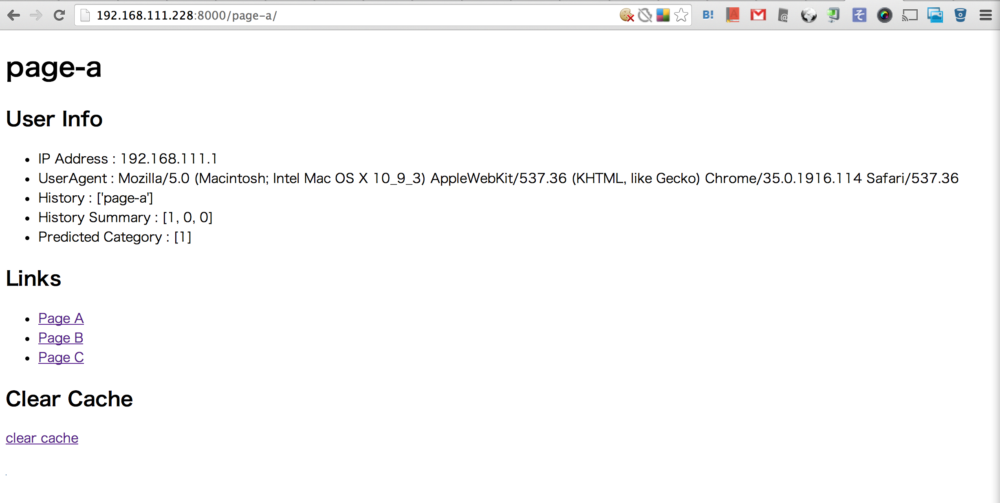

toy-recommend-webpage
=====================

Trying to create a simple recommendation web system

## Requirement

- Vagrant

## Components

- Vagrant on VirtualBox
    - Ubuntu 12.04 precise
- Web Framework
    - Djangoh
- Machine Learning Library 
    - Scikit-Learn

## Building This Project

### Launch a Vagrant instance

`/vagrant` on the vagrant is linked to the basic path of this project.
The IP address of the lanched machine is set as `192.168.111.228`.
Please check `./vagrant/Vagrantfile`.

```shell
cd ./vagrant
vagrant up
```

### Launch Django Server

#### SSSH Login to The Vagrant Machine

You have to execute command on your host machine.

```shell
cd ./vagrant
vagrant ssh
```

#### Launch Django Server on Vagrant

You have to execute command on the vagrang machine.

```shell
cd /vagrant/webapp
./sbin/runserver.sh
```

##### Option

If you want to initialize sqlite database, execute `make init`

#### Check Whether The Django Server is correctly executed

You need to browse on your host machine.
Please see also `./webapp/sbin/runserver.sh` which is the script to launch django server.

```shell
curl http://192.168.111.228:8000/
```

## Usage

At the first, access to `http://192.168.111.228.8000/page-a/`, then you can see a page like the below image.



- User Info: your Information
    - IP Address: your IP address
    - UserAgent: your UserAgent
    - History: your last 10 page access history in this toy recommend system
    - History Summary: summarize each page count
    - Predicted Category: result of SVM prediction by your access history
- Links: browsing this links, predicted category will be changed
    - Page A: link to `page-a`
    - Page B: link to `page-b`
    - Page C: link to `page-c`
- Clear Cache
    - click `clear-cache`, then your access history is cleared

## Explaining the Implementation

### Train SVM

I trained a SVM model with scikit-learn.

### Generating Trained Data and Tested Data

I generated a dataset for training and testing model with `./resources/data/generated-train-data.R`.
As a result of the script, `train-data.tsv`, `train-label.tsv`, `test-data.tsv` and `test-label.tsv` were generated.

### Predict by Trained Model which is Sotred in a File

You can train a SVM model with `./webapp/bin/train-svm.py` as I did.
The script store the trained model as a pickled object `webapp/resources/trained-svm.pickle`.
You can deserialize the object.

```python
import pickle
file = open("resources/trained-svm.pickle", "rb")
data = pickle.load(file)
data.predict([8, 1, 1])
data.predict([2, 3, 5])
```

## Do Testing Python Code

If you want to test python source code, and then please execute below command.

```shell
cd ./webapp/
make test-code
```
